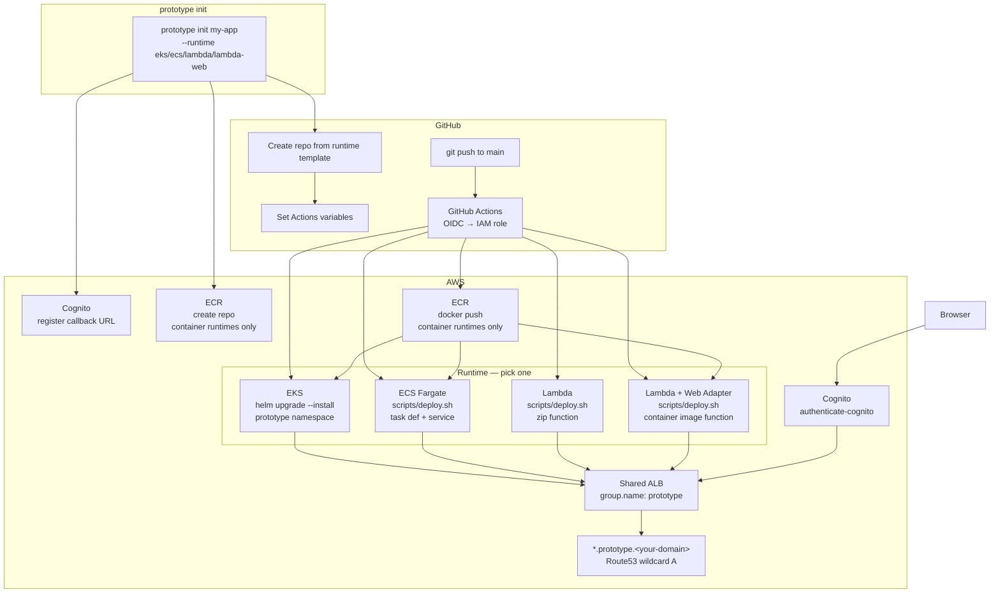

# Prototype Platform

An internal deployment platform that lets you ship prototypes like Vercel — one command gives you a Cognito-authenticated HTTPS endpoint on AWS.

```
prototype init my-app
# → https://my-app.prototype.<your-domain>  (~3 min after first push)
```

---

## Why this exists

| Pain point | How this platform solves it |
|---|---|
| Want to share a prototype internally, securely | `prototype init` issues a Cognito-gated HTTPS URL instantly. No public access without login |
| Don't want to touch AWS every time | ECR, EKS deployment, DNS, and TLS certificates are shared infrastructure — zero per-service setup |
| Don't want AWS credentials in GitHub | GitHub Actions uses OIDC to assume a short-lived IAM role. No stored secrets |
| Don't want to write a deploy pipeline | Push to `main` on the template repo and it deploys automatically |
| Don't want to manage access control | Every service gets Cognito auth automatically. Users are managed centrally in one user pool |

---

## Architecture



### Components

| Component | Path | Purpose |
|---|---|---|
| CLI | `cli/` | `prototype init` / `login` / `runtimes` / `destroy` — runtime-aware |
| Template (EKS) | `template-repo/` | Service starter for EKS — Helm chart + Actions workflow |
| Template (ECS) | `template-repo-ecs/` | Service starter for ECS Fargate — `scripts/deploy.sh` + Actions workflow |
| Template (Lambda) | `template-repo-lambda/` | Service starter for Lambda — native handler, `scripts/deploy.sh` |
| Template (Lambda+LWA) | `template-repo-lambda-web/` | Service starter for Lambda Web Adapter — same app as ECS/EKS, container image |
| Terraform — EKS cluster | `terraform/eks-prototype/` | VPC, EKS Auto Mode cluster, IAM roles, GitHub OIDC provider |
| Terraform — EKS platform | `terraform/eks-prototype-platform/` | Cognito, wildcard ACM cert, Route53, ALB Controller |
| Terraform — ECS cluster | `terraform/ecs-prototype/` | VPC, ECS Fargate cluster, task roles, GitHub OIDC provider |
| Terraform — ECS platform | `terraform/ecs-prototype-platform/` | Cognito, wildcard ACM cert, Route53, shared ALB + listener |
| Terraform — Lambda base | `terraform/lambda-prototype/` | VPC (ALB only), Lambda exec role, GitHub OIDC provider |
| Terraform — Lambda platform | `terraform/lambda-prototype-platform/` | Cognito, wildcard ACM cert, Route53, shared ALB + listener |

### Runtimes

This is an AWS sample, so the compute backend is a choice — pick the one that
matches the customer's stack. The developer experience is identical across
runtimes (`prototype init`, Cognito auth, shared ALB + wildcard DNS); only the
execution target and its deploy pipeline differ.

| Runtime | Pick when | Deploys via |
|---|---|---|
| **ECS (Fargate)** | Containers without Kubernetes operational overhead (most teams) | `scripts/deploy.sh` (ECS service + ALB rule) |
| **EKS** | You already run Kubernetes / need its scheduling and portability | `helm upgrade` (ALB controller) |
| **Lambda** | Event-driven / bursty / low-frequency (batch, automation, webhooks); scale-to-zero | `scripts/deploy.sh` (function + Lambda target group + ALB rule) |
| **Lambda + Web Adapter** | Web/API apps on Lambda **without rewriting** — same Express app as ECS/EKS, scale-to-zero | `scripts/deploy.sh` (container-image function + Lambda target group + ALB rule) |

The admin enables one or more runtimes in `config.json` (`runtimes` map) and sets
`defaultRuntime`. Users target the default automatically, or pick explicitly:

```
prototype init my-app                      # default runtime
prototype init batch --runtime lambda      # explicit
prototype init app   --runtime lambda-web  # Lambda, but a normal web app (LWA)
prototype runtimes                         # list what this platform enabled
```

### Multiple deployments in one account

Every stack takes an **optional deployment suffix** so several installs can
coexist in one account (e.g. `ecs` + `lambda`, or `dev` + `staging`). Names are
**deterministic** — there is no randomness, so an apply with the same inputs
never churns resources.

- **Default is no suffix.** With `suffix = ""` (and the `default` workspace) every
  name is exactly the original (`prototype`, `prototype.<domain>`, …). Re-applying
  an existing install is a **no-op** — nothing is renamed or recreated.
- **Add a deployment** by setting `-var "suffix=dev"`, or just by working in a
  Terraform **workspace** — the workspace name becomes the suffix
  (`terraform workspace new dev` → names get `-dev`, subdomain
  `*.prototype-dev.<domain>`). The `default` workspace stays un-suffixed.
- **Platform stack inherits** the base stack's suffix, VPC, and subnets via
  `terraform_remote_state` (same workspace) — the two halves never drift.
- **OIDC provider** is account-global, so the first deployment creates it and the
  rest set `-var "create_github_oidc_provider=false"` to reference it. (A `moved`
  block migrates a provider created before this toggle, so adding it is no-op.)
- **No hard-coded names** in the service templates — `prototype init` passes the
  deploy-role ARN, ALB/cluster name, etc. as Actions variables from `config.json`,
  so coexisting deployments are just separate `runtimes` entries pointing at the
  names from `terraform output`.

### Shared infrastructure design

- **One ALB for all services** — Ingresses share a single ALB via the `group.name: prototype` annotation. No per-service load balancer means lower cost and simpler DNS.
- **Wildcard TLS certificate** — A single `*.prototype.<your-domain>` ACM cert covers every service. Adding a new service requires no certificate work.
- **Automatic DNS delegation** — Terraform creates the `prototype.<your-domain>` child zone and writes the NS delegation record into the parent zone automatically.

### Security design

- **Continuous SAST/SCA/IaC scanning** — Every push and PR runs [AWS Automated Security Helper](https://github.com/awslabs/automated-security-helper) (`.github/workflows/security-scan.yml`). It aggregates Bandit, OpenGrep, Checkov, cfn-nag, npm-audit, Grype, and detect-secrets, posts a summary comment on the PR, and uploads SARIF to GitHub Code Scanning. The job fails on findings so security regressions block merges.
- **No static AWS credentials anywhere** — GitHub Actions assumes an IAM role via OIDC. The trust policy restricts AssumeRole to the `main` branch of repos matching `<github_org>/prototype-*` (configurable via `github_repo_pattern`).
- **Namespace-scoped EKS access** — The GitHub Actions role is granted `AmazonEKSEditPolicy` scoped to the `prototype` namespace only. It cannot touch the rest of the cluster.
- **Admin-only user creation** — Cognito is configured with `allow_admin_create_user_only = true`. End users cannot self-register. Password policy requires 14+ chars with mixed case, digits, and symbols. MFA defaults to `OPTIONAL` (TOTP) — set `cognito_mfa_configuration = "ON"` to enforce it.
- **Hardened service template** — Generated services run as non-root with a read-only root filesystem, drop all Linux capabilities, ship with liveness/readiness probes hitting `/healthz`, default to 2 replicas with a PodDisruptionBudget, and the GitHub Actions deploy uses `helm upgrade --atomic` so failed rollouts roll back automatically.

### Known limits

| Limit | Value | Workaround |
|---|---|---|
| Services per ALB listener | 100 (ALB rule quota) | `prototype destroy` unused services, or request a quota increase for *Rules per Application Load Balancer* |
| Services per Cognito app client | 100 (callback URL limit) | Same as above; manually prune stale callback URLs from the client if needed |
| Max synchronous Lambda response | ~6 MB / 15 min | Use ECS or EKS for large-payload or long-running workloads |
| Runtimes requiring a GitHub OIDC provider | 1 per AWS account | Pass `-var "create_github_oidc_provider=false"` on every base-stack apply after the first |

### Estimated cost

Costs depend on which runtimes you enable and how many services run. Rough monthly figures at low traffic in `ap-northeast-1`:

| Component | Approximate cost |
|---|---|
| EKS Auto Mode cluster (1 node) | ~$80–150/mo |
| ECS Fargate (2 replicas × 0.25 vCPU / 512 MB) | ~$10–20/mo per service |
| Shared ALB | ~$20/mo (fixed) + data transfer |
| ACM certificate | Free |
| Route53 hosted zone | $0.50/mo per zone |
| Cognito | Free up to 50k MAU |
| Lambda | Near-zero at low frequency (pay-per-request) |

Enable only the runtimes you need. EKS has the highest fixed cost; Lambda has near-zero idle cost.

---

## Usage

### 1. Install the CLI

```bash
cd cli && npm install && npm run build && npm link
```

Create `~/.config/prototype/config.json`:

```json
{
  "authProvider": "cognito",
  "authClientId": "<cognito_cli_client_id>",
  "cognitoDomain": "<user_pool_domain>.auth.<region>.amazoncognito.com",
  "callbackPort": 8765,
  "awsRegion": "<region>",
  "awsAccountId": "<account_id>",
  "baseDomain": "prototype.<your-domain>",
  "githubOrg": "<your_github_org>",
  "cognitoUserPoolId": "<user_pool_id>",
  "cognitoAlbClientId": "<cognito_alb_client_id>",
  "cognitoUserPoolArn": "<user_pool_arn>",
  "cognitoUserPoolDomain": "<user_pool_domain>",
  "acmCertificateArn": "<acm_certificate_arn>",

  "defaultRuntime": "ecs",
  "runtimes": {
    "ecs":        { "templateRepo": "ecs-prototype-template",     "clusterName": "prototype-ecs-dev", "needsEcr": true,  "deployRoleArn": "arn:aws:iam::<account>:role/github-actions-prototype-ecs-dev" },
    "lambda":     { "templateRepo": "lambda-prototype-template",  "albName": "prototype-lambda-dev",  "needsEcr": false, "deployRoleArn": "arn:aws:iam::<account>:role/github-actions-prototype-lambda-dev" },
    "lambda-web": { "templateRepo": "lambda-web-prototype-template", "albName": "prototype-lambda-dev", "needsEcr": true, "deployRoleArn": "arn:aws:iam::<account>:role/github-actions-prototype-lambda-dev" }
  }
}
```

> - The `clusterName` / `albName` / `deployRoleArn` values are the **suffixed**
>   names from `terraform output` — that's how the CLI follows whatever suffix a
>   deployment used. `deployRoleArn` is optional; it defaults to
>   `…:role/github-actions-prototype` (the EKS base stack's un-suffixed deploy
>   role name) — ECS and Lambda runtimes should always pass it explicitly.
> - `lambda-web` rides the same `lambda-prototype` platform as `lambda` (same
>   `albName`), but uses a container image, so `needsEcr` is true.
> - Older configs using the flat `clusterName` / `githubTemplateRepo` fields
>   still work — they fold into a `runtimes.eks` entry automatically.

All values are available from the platform Terraform outputs:

```bash
cd terraform/eks-prototype-platform && terraform output
```

### 2. Log in

```bash
prototype login    # opens a browser window for Cognito login
```

### 3. Create a service

```bash
prototype init my-app
```

Under the hood this:
1. Registers `https://my-app.prototype.<your-domain>` as a Cognito callback URL
2. Creates a private GitHub repo `prototype-my-app` from the template
3. Sets 10 GitHub Actions variables (ECR URI, cluster name, Cognito ARNs, etc.)
4. Creates the ECR repository `prototype/my-app`

If any step fails, completed steps are rolled back automatically. Re-running the
command on a name that already exists fails fast at the pre-flight check.

### 4. Deploy your app

```bash
git clone <repo URL printed by prototype init>
cd my-app
# edit the Dockerfile and implement your app
git push origin main
```

GitHub Actions will automatically:
- Build the Docker image and push it to ECR
- Run `helm upgrade --install` to deploy to EKS

Your app is live at `https://my-app.prototype.<your-domain>` about 3 minutes after the push.

---

## Template repository structure

Each runtime ships its own template repo with the same application code (an
Express app on port 8080 serving `/healthz`) but a runtime-specific deploy
pipeline. All four authenticate at the **shared ALB**, so the application code
never handles auth.

| Template | Deploy mechanism | Auth wired via |
|---|---|---|
| `template-repo/` (EKS) | `helm upgrade --install --atomic` | Helm Ingress `authenticate-cognito` annotations |
| `template-repo-ecs/` | `scripts/deploy.sh` (task def + service + listener rule) | ALB listener rule with `authenticate-cognito` action |
| `template-repo-lambda/` | `scripts/deploy.sh` (zip → function + Lambda target group + rule) | ALB listener rule with `authenticate-cognito` action |
| `template-repo-lambda-web/` | `scripts/deploy.sh` (container-image function + Lambda target group + rule) | ALB listener rule with `authenticate-cognito` action |

See the README in each template directory for runtime-specific details.

---

## Platform setup (admin only)

### Prerequisites

| Requirement | Notes |
|---|---|
| AWS account with admin access | |
| A domain hosted in Route53 | The platform creates a `prototype.<your-domain>` child zone automatically |
| Terraform >= 1.9 | |
| GitHub CLI (`gh`) | run `gh auth login` first |
| Node.js 20+ | CLI runtime |
| Docker | Building container images locally (ECS / EKS / Lambda-Web service templates) |
| `kubectl`, `helm` | EKS runtime only |

> **Region.** Every Terraform stack defaults to `ap-northeast-1`. Override with
> `-var "aws_region=<region>"` consistently across all `terraform apply` calls
> and across `terraform init -backend-config="region=<region>"`.

### Step 1 — Create the Terraform backend

Pick a globally-unique S3 bucket name (e.g. `<your-org>-prototype-tfstate`) and
a DynamoDB lock-table name. Every stack uses a **partial backend**, so the
bucket and lock-table names are passed at `terraform init` time — you never
edit the `.tf` source.

```bash
export TF_STATE_BUCKET="<your-org>-prototype-tfstate"
export TF_LOCK_TABLE="<your-org>-prototype-tflock"
export AWS_REGION="ap-northeast-1"

aws s3 mb "s3://${TF_STATE_BUCKET}" --region "${AWS_REGION}"
aws s3api put-bucket-versioning \
  --bucket "${TF_STATE_BUCKET}" \
  --versioning-configuration Status=Enabled
aws s3api put-bucket-encryption \
  --bucket "${TF_STATE_BUCKET}" \
  --server-side-encryption-configuration \
    '{"Rules":[{"ApplyServerSideEncryptionByDefault":{"SSEAlgorithm":"AES256"}}]}'
aws s3api put-public-access-block \
  --bucket "${TF_STATE_BUCKET}" \
  --public-access-block-configuration \
    "BlockPublicAcls=true,IgnorePublicAcls=true,BlockPublicPolicy=true,RestrictPublicBuckets=true"
aws dynamodb create-table \
  --table-name "${TF_LOCK_TABLE}" \
  --attribute-definitions AttributeName=LockID,AttributeType=S \
  --key-schema AttributeName=LockID,KeyType=HASH \
  --billing-mode PAY_PER_REQUEST \
  --region "${AWS_REGION}"
```

Every later `terraform init` will use these via:

```bash
terraform init \
  -backend-config="bucket=${TF_STATE_BUCKET}" \
  -backend-config="dynamodb_table=${TF_LOCK_TABLE}"
```

### Step 2 — Pick one or more runtimes

You can enable any subset of `eks` / `ecs` / `lambda` / `lambda-web`. Each
runtime has a **base stack** (cluster / exec role / OIDC + VPC) and a
**platform stack** (Cognito, ACM, DNS, shared ALB). Apply the base first, the
platform second. The first runtime you install creates the account-global
GitHub OIDC provider; later runtimes reference it with
`-var "create_github_oidc_provider=false"`.

The flags below assume the env vars from Step 1.

<details>
<summary><strong>EKS</strong> — managed Kubernetes</summary>

```bash
# Base — VPC + EKS Auto Mode cluster + IAM + OIDC
cd terraform/eks-prototype
terraform init \
  -backend-config="bucket=${TF_STATE_BUCKET}" \
  -backend-config="dynamodb_table=${TF_LOCK_TABLE}"
terraform apply \
  -var "github_org=<your_github_org>" \
  -var 'cluster_public_access_cidrs=["203.0.113.0/24"]'   # office/VPN CIDR — set ["0.0.0.0/0"] only if you accept the trade-off

# Platform — Cognito + ACM + Route53 + ALB Controller + `prototype` namespace
cd ../eks-prototype-platform
terraform init \
  -backend-config="bucket=${TF_STATE_BUCKET}" \
  -backend-config="dynamodb_table=${TF_LOCK_TABLE}"
terraform apply \
  -var "aws_account_id=<account_id>" \
  -var "base_domain=<your-domain>" \
  -var "state_bucket=${TF_STATE_BUCKET}"
```

> `cluster_public_access_cidrs` has no default — you must pass it. If you apply
> from an assumed role, also pass `-var "cluster_admin_principal_arn=arn:aws:iam::ACCOUNT:role/YOUR_ROLE"`
> — EKS access entries do not accept STS session ARNs.

</details>

<details>
<summary><strong>ECS Fargate</strong> — containers without Kubernetes</summary>

```bash
# Base — VPC + ECS cluster + IAM + OIDC + shared service SG
cd terraform/ecs-prototype
terraform init \
  -backend-config="bucket=${TF_STATE_BUCKET}" \
  -backend-config="dynamodb_table=${TF_LOCK_TABLE}"
terraform apply -var "github_org=<your_github_org>"

# Platform — Cognito + ACM + Route53 + shared ALB + 443 listener
cd ../ecs-prototype-platform
terraform init \
  -backend-config="bucket=${TF_STATE_BUCKET}" \
  -backend-config="dynamodb_table=${TF_LOCK_TABLE}"
terraform apply \
  -var "aws_account_id=<account_id>" \
  -var "base_domain=<your-domain>" \
  -var "state_bucket=${TF_STATE_BUCKET}"
```

</details>

<details>
<summary><strong>Lambda</strong> — native handler, scale-to-zero</summary>

```bash
# Base — VPC (ALB-only) + Lambda exec role + OIDC
cd terraform/lambda-prototype
terraform init \
  -backend-config="bucket=${TF_STATE_BUCKET}" \
  -backend-config="dynamodb_table=${TF_LOCK_TABLE}"
terraform apply -var "github_org=<your_github_org>"

# Platform — Cognito + ACM + Route53 + shared ALB + 443 listener
cd ../lambda-prototype-platform
terraform init \
  -backend-config="bucket=${TF_STATE_BUCKET}" \
  -backend-config="dynamodb_table=${TF_LOCK_TABLE}"
terraform apply \
  -var "aws_account_id=<account_id>" \
  -var "base_domain=<your-domain>" \
  -var "state_bucket=${TF_STATE_BUCKET}"
```

</details>

<details>
<summary><strong>Lambda + Web Adapter</strong> — same Express app as ECS/EKS, on Lambda</summary>

This runtime shares the **`lambda-prototype` base and platform stacks** with
the `lambda` runtime above — apply them once and both runtimes are usable.
Difference is only at service creation time (`prototype init --runtime lambda-web`),
which builds a container image and creates a container-image function.

</details>

> **Multiple deployments in one account.** Every stack accepts an optional
> `-var "suffix=dev"` (or just use a non-`default` Terraform workspace), and
> all resource names get the suffix appended. The platform stack inherits the
> base stack's suffix automatically. See *Multiple deployments in one
> account* above. Set `-var "create_github_oidc_provider=false"` on every
> deployment after the first so they reference the existing provider.
>
> **Custom name prefix.** If `prototype-platform` collides with another
> deployment in the account, or you want a different Cognito hosted-domain,
> pass `-var "name_prefix=<your-prefix>"` to the platform stack.

### Step 3 — Publish the template repositories

Publish only the templates for the runtimes you enabled in Step 2. Repo names
must match the `runtimes.<runtime>.templateRepo` value in your CLI config
(Step 5).

```bash
# EKS
cd template-repo
gh repo create <ORG>/eks-prototype-template --private --source=. --push
gh api --method PATCH repos/<ORG>/eks-prototype-template -f is_template=true

# ECS
cd ../template-repo-ecs
gh repo create <ORG>/ecs-prototype-template --private --source=. --push
gh api --method PATCH repos/<ORG>/ecs-prototype-template -f is_template=true

# Lambda
cd ../template-repo-lambda
gh repo create <ORG>/lambda-prototype-template --private --source=. --push
gh api --method PATCH repos/<ORG>/lambda-prototype-template -f is_template=true

# Lambda + Web Adapter
cd ../template-repo-lambda-web
gh repo create <ORG>/lambda-web-prototype-template --private --source=. --push
gh api --method PATCH repos/<ORG>/lambda-web-prototype-template -f is_template=true
```

### Step 4 — Create a Cognito user

```bash
aws cognito-idp admin-create-user \
  --user-pool-id <user_pool_id> \
  --username <email> \
  --user-attributes Name=email,Value=<email> Name=email_verified,Value=true \
  --temporary-password <temp_password> \
  --region <region>
```

### Step 5 — Wire up the CLI config

Plug the Terraform outputs from each platform stack into
`~/.config/prototype/config.json` (see [Usage → Install the CLI](#1-install-the-cli)
above for the schema). Each runtime gets one entry in the `runtimes` map; set
`defaultRuntime` to the one users should hit by default.

```bash
cd terraform/<runtime>-prototype-platform && terraform output
cd ../<runtime>-prototype             && terraform output     # role ARN + cluster/alb name
```

The mapping from Terraform output keys to `config.json` fields:

| `config.json` field            | Terraform stack                 | Output key                          |
|---|---|---|
| `authClientId`                 | `<runtime>-prototype-platform`  | `cognito_cli_client_id`             |
| `cognitoDomain`                | `<runtime>-prototype-platform`  | `cognito_user_pool_domain` + `.auth.<region>.amazoncognito.com` |
| `cognitoUserPoolId`            | `<runtime>-prototype-platform`  | `cognito_user_pool_id`              |
| `cognitoAlbClientId`           | `<runtime>-prototype-platform`  | `cognito_alb_client_id`             |
| `cognitoUserPoolArn`           | `<runtime>-prototype-platform`  | `cognito_user_pool_arn`             |
| `cognitoUserPoolDomain`        | `<runtime>-prototype-platform`  | `cognito_user_pool_domain`          |
| `acmCertificateArn`            | `<runtime>-prototype-platform`  | `acm_certificate_arn`               |
| `baseDomain`                   | platform stack `var.base_domain`| `prototype.<base_domain>` (or `prototype-<suffix>.<base_domain>`) |
| `awsRegion` / `awsAccountId`   | —                               | from `aws configure`/`aws sts get-caller-identity` |
| `githubOrg`                    | —                               | the value you passed as `github_org` |
| `runtimes.<rt>.deployRoleArn`  | `<runtime>-prototype` (base)    | `github_actions_deploy_role_arn`    |
| `runtimes.ecs.clusterName`     | `ecs-prototype` (base)          | `cluster_name`                      |
| `runtimes.lambda.albName`      | `lambda-prototype` (base)       | `alb_name`                          |
| `runtimes.lambda-web.albName`  | `lambda-prototype` (base)       | `alb_name` (shared with `lambda`)   |

> The EKS runtime does not need a `clusterName` or `albName` in `config.json` —
> the deploy pipeline discovers the cluster via `aws eks update-kubeconfig` and
> the ALB via the `group.name: prototype` Ingress annotation.

---

## Repository layout

```
.
├── cli/                          # prototype CLI (TypeScript)
│   └── src/
│       ├── commands/             # init / login / whoami / destroy / runtimes
│       ├── aws/ecs.ts            # ECS service + ALB-rule teardown
│       ├── config.ts             # runtime resolution (runtimes map)
│       └── auth/                 # Cognito OAuth2 PKCE flow
├── template-repo/                # EKS service starter (Helm chart)
├── template-repo-ecs/            # ECS service starter (scripts/deploy.sh)
├── template-repo-lambda/         # Lambda service starter (native handler)
├── template-repo-lambda-web/     # Lambda + Web Adapter service starter (container)
└── terraform/
    ├── eks-prototype/            # EKS Stack 1: cluster
    ├── eks-prototype-platform/   # EKS Stack 2: Cognito, ACM, DNS, ALB Controller
    ├── ecs-prototype/            # ECS Stack 1: VPC, Fargate cluster, IAM, OIDC
    ├── ecs-prototype-platform/   # ECS Stack 2: Cognito, ACM, DNS, shared ALB
    ├── lambda-prototype/         # Lambda Stack 1: VPC (ALB only), exec role, OIDC
    └── lambda-prototype-platform/ # Lambda Stack 2: Cognito, ACM, DNS, shared ALB
```

---

## FAQ

**How do I add a Cognito user?**

Use `admin-create-user` via the AWS console or CLI. Self-registration is disabled (`allow_admin_create_user_only = true`).

**How do I delete a service?**

```bash
prototype destroy <service-name>
```

This removes the Helm release, the Cognito callback URL, the ECR repository,
and the GitHub repo. Pass `--keep-repo` to preserve the GitHub repo, or `-y`
to skip the confirmation prompt.

**How do I tear down the entire platform?**

Destroy stacks in reverse order — platform before base, within each stack any
services first. Run `prototype destroy` on every service before starting.

```bash
# EKS example — repeat for each runtime you installed
cd terraform/eks-prototype-platform && terraform destroy
cd ../eks-prototype              && terraform destroy

# ECS
cd terraform/ecs-prototype-platform && terraform destroy
cd ../ecs-prototype                 && terraform destroy

# Lambda (shared by lambda and lambda-web)
cd terraform/lambda-prototype-platform && terraform destroy
cd ../lambda-prototype                 && terraform destroy
```

> The GitHub OIDC provider is created by the first base stack. If you run
> multiple runtimes, only the stack that created it will destroy it; the others
> reference it with `create_github_oidc_provider=false` and have nothing to
> delete. Delete the provider manually in the IAM console if needed.

**`prototype init` fails with "GitHub token not found"**

Run `gh auth login`, or set `GITHUB_TOKEN` to a token with the `administration` scope.

**Why are there two Terraform stacks per runtime?**

The **base** stack (`eks-prototype` / `ecs-prototype` / `lambda-prototype`)
provisions the cluster or exec role and the VPC; it rarely needs to change.
The **platform** stack on top changes more often (Cognito settings, DNS
tweaks, ALB / ALB Controller upgrades). Keeping them separate limits the
blast radius of each `terraform plan` and lets a platform-stack rollback
leave the cluster untouched.

**Can I use Okta instead of Cognito for CLI login?**

Yes — the CLI auth layer supports both. Set `AUTH_PROVIDER=okta` (and the
related `AUTH_ISSUER` / `AUTH_CLIENT_ID` env vars, or the equivalent fields in
`~/.config/prototype/config.json`). The CLI then runs the Okta device
authorization grant flow. Note that the **ALB** still uses Cognito for the
`authenticate-cognito` listener action — only the CLI's user-login flow is
swapped.

---

## Troubleshooting

**GitHub Actions: `Error: Not authorized to perform sts:AssumeRoleWithWebIdentity`**

The OIDC trust policy restricts AssumeRole to `repo:<github_org>/<github_repo_pattern>:ref:refs/heads/main`.
Causes:

- The service repo's name doesn't match `github_repo_pattern` (default `prototype-*`).
  Either rename the repo, or re-apply the base stack with a broader pattern.
- The workflow is running on a branch other than `main`. The trust policy only
  accepts `refs/heads/main` — feature branches cannot deploy.
- The repo lives under a different GitHub org than the one in `var.github_org`.

**`prototype init` fails: Cognito `LimitExceededException` on `UpdateUserPoolClient`**

A Cognito app client supports up to 100 callback URLs. Once the platform has
that many services registered, `prototype init` cannot add another. Either
`prototype destroy` an unused service, or rotate the ALB client by manually
pruning stale `callback_urls` (the resource has `ignore_changes = [callback_urls]`
so Terraform will not touch them).

**Deploy fails: ALB `TooManyListenerRulesException`**

Each ALB listener accepts up to 100 rules (the default soft quota). Every
`prototype init` adds one rule. Either `prototype destroy` unused services, or
request a quota increase for `Rules per Application Load Balancer`.

**`admin-create-user` succeeds but no welcome email arrives**

Cognito sends invitations via SES. If the SES account is in the sandbox (every
new AWS account starts there), Cognito can only deliver to *verified* recipient
addresses. Either verify the recipient in SES, request SES production access,
or create the user with `--message-action SUPPRESS` and share the temporary
password out-of-band.

**Second runtime install fails: `EntityAlreadyExists: …/token.actions.githubusercontent.com`**

An AWS account can hold only one GitHub OIDC provider for a given issuer URL.
Pass `-var "create_github_oidc_provider=false"` on every base-stack `terraform
apply` after the first.

**EKS apply fails: `the IAM principal ... has no access entry`**

`cluster_admin_principal_arn` defaults to the calling identity, but EKS access
entries reject STS session ARNs (e.g.
`arn:aws:sts::123456789012:assumed-role/AdminRole/session`). If you apply from
an assumed role, pass the underlying IAM role ARN explicitly:
`-var "cluster_admin_principal_arn=arn:aws:iam::123456789012:role/AdminRole"`.

**Platform stack apply fails reading `<runtime>-prototype/terraform.tfstate`**

The platform stack reads the base stack's outputs via `terraform_remote_state`
(same `state_bucket`, same workspace). Common causes:

- `state_bucket` not passed (or wrong bucket name).
- The base stack was applied in a different Terraform workspace than the
  platform stack — they must match.

**`prototype destroy` fails: Lambda function `ResourceInUseException`**

The service's listener rule is still attached. The destroy flow removes ALB
wiring before the function; if it left a rule behind, delete the matching
listener rule by hand in the EC2 console (ALB → listener 443 → rules), then
re-run `prototype destroy`.

---

## Contributing

Bug reports, feature requests, and pull requests are welcome — see
[CONTRIBUTING.md](CONTRIBUTING.md) for the process. Please report
**security issues privately** as described in [SECURITY.md](SECURITY.md);
do not open a public issue.

This project follows the
[Amazon Open Source Code of Conduct](CODE_OF_CONDUCT.md).

## License

Licensed under [MIT-0](LICENSE) — MIT No Attribution.
